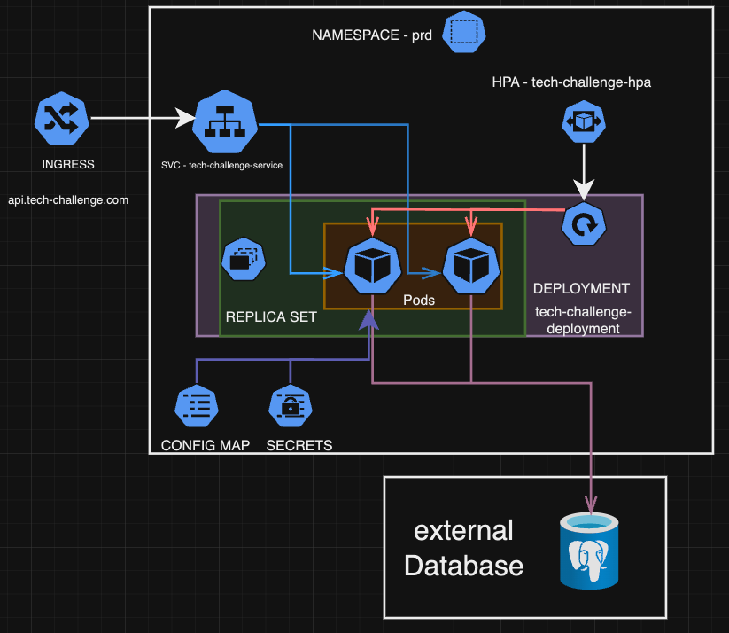

[](https://sonarcloud.io/summary/new_code?id=pangolin-do-golang_tech-challenge) 

Miro Board: https://miro.com/app/board/uXjVKVoZwos=/?share_link_id=718027124865

# Tech Challenge Customer API

## Install

### Go 

- [Go Install](https://go.dev/doc/install)

> Make sure you have Go 1.22.2 or higher

Execute 

```shell
go mod tidy
```

## Defining Envs

To correctly use the project, it is necessary to define a .env file, with the values for the envs:

* DB_USERNAME 
* DB_PASSWORD 
* DB_HOST 
* DB_NAME 
* DB_PORT

We recommend using for development the following values:

```
DB_USERNAME=user
DB_PASSWORD=pass
DB_HOST=pgsql
DB_NAME=postgres
DB_PORT=5432
```

## Executing with Docker (Compose)

```shell
docker compose build

docker compose up -d

curl --request GET --url http://localhost:8080/health

## Expected response
= Status Code 200
```

> If you're having trouble deploying the application with `docker-compose` (and not `docker compose`), use docker version 27.0.0 or higher.

## Accessing Swagger UI

Go to http://localhost:8080/swagger/index.html#/ after the application is running.

## Guide

Follow the guide (in portuguese) for a step-by-step guide to the project [here](https://github.com/pangolin-do-golang/tech-challenge/wiki/Guia-de-uso-da-API).

## Stack

- [Go](https://go.dev/)
- [Gin Web Framework](https://gin-gonic.com/) - Routes, JSON validation, Error management, Middleware support
- [PostgresSQL](https://www.postgresql.org/) - Database
- [swag](https://github.com/swaggo/swag) - Tool to generate swagger documentation
- [docker](https://www.docker.com/) - Containerization tool
- [docker-compose](https://docs.docker.com/compose/) - Tool to define and run multi-container Docker applications


## DDD with event storm

The team chose to use [Miro](https://miro.com/) to document this deliverable, available at the [link](https://miro.com/app/board/uXjVKVoZwos=/?share_link_id=10494235831).

The diagram contains:

* System documentation in DDD with Event Storm
* Caption for the ubiquitous language used
* Additional details to understand the proposed resolution
* Order fulfillment and payment flow
* Order preparation and delivery flow

## Architecture

This project follows the models proposed by Clean Architecture


## Swagger

This project makes use of the library [swag](https://github.com/swaggo/swag?tab=readme-ov-file#how-to-use-it-with-gin) to generate the swagger documentation.

### Install

Follow the steps described in the [official documentation](https://github.com/swaggo/swag?tab=readme-ov-file#getting-started)

### Generate 

```shell
 swag init -g cmd/http/main.go 
```

### Access the documentation

The documentation can be founded at the path `/docs/swagger.yaml` or accessing this [link](./docs/swagger.yaml).

## Infrastructure

[Requirements Infrastructure](https://github.com/pangolin-do-golang/tech-challenge/blob/main/terraform/README.md)

## Kubernetes

The Kubernetes templates are located at the `/deploy/k8s` folder, you can use it to create a local k8s setup with minikube

The order of execution is:
1. namespaces
2. secret > you should update the secret value with the database password
3. deployment
4. hpa
5. service

You can forward the port with the following command:

```bash
kubectl port-forward svc/tech-challenge-service 4000:80 -n dev
```

### Kubernates Architecture



## Project structure

- `cmd`: Application entry point directory for the application's main entry points, dependency injection, or commands. The web subdirectory contains the main entry point to the REST API.
- `internal`: Directory to contain application code that should not be exposed to external packages.
    - `core`: Directory that contains the application's core business logic.
        - `cart`: Directory contains definition of the entity's heights, interfaces, repository and service of the entity Cart.
        - `customer`: Directory contains definition of the entity's heights, interfaces, repository and service of the entity Customer.
        - `order`: Directory contains definition of the entity's heights, interfaces, repository and service of the entity Order.
        - `product`: Directory contains definition of the entity's heights, interfaces, repository and service of the entity Product.
    - `adapters`: Directory to contain external services that will interact with the application core.
        - `db`: Directory contains the implementation of the repositories.
        - `rest`: Directory that contains the definition of the application's controllers and handlers for manipulating data provided by the controller
  - `domainerrors`: Directory that contains the definition of the application's domain errors.
